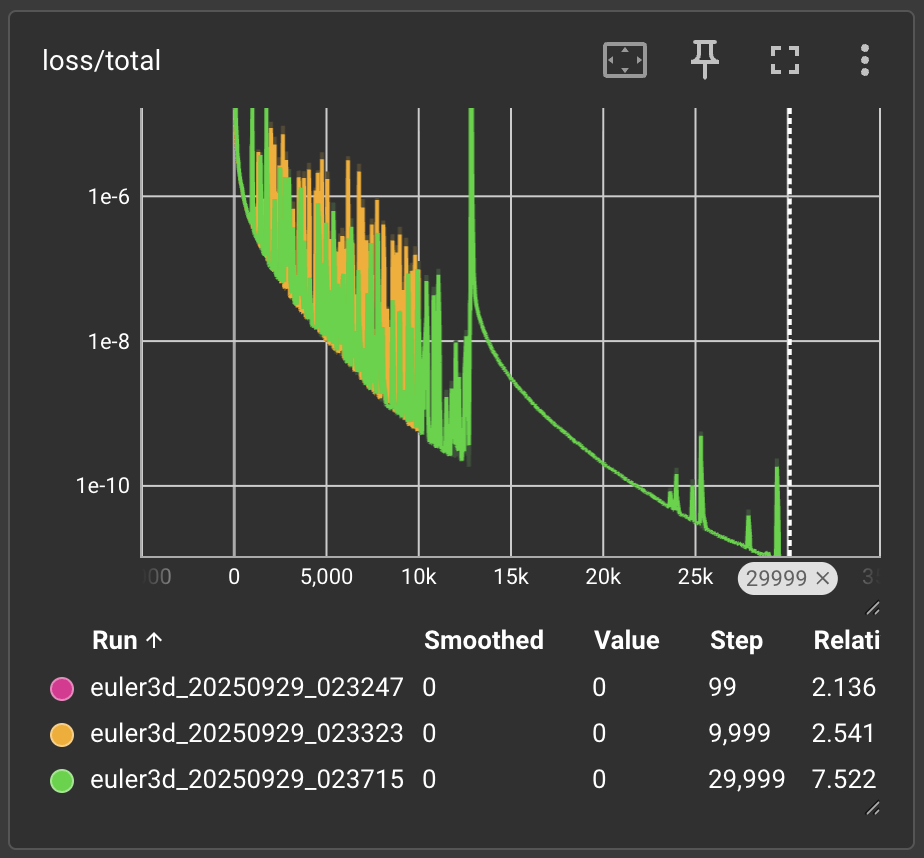

# Discovery of Unstable Singularities in Fluid Dynamics with Physics-Informed Neural Networks

This repository attempts to replicate the results of the paper [*Discovery of Unstable Singularities*](https://arxiv.org/pdf/2509.14185) by Yongji Wang, Mehdi Bennani, et al. (17 September 2025).
The work presents the **first systematic framework for discovering unstable singularities** in nonlinear PDEs, a problem long considered intractable with traditional numerical methods.

## Background

Finite-time singularities in fluids, where smooth solutions to governing PDEs (such as the Euler or Navier-Stokes equations) develop infinite gradients, are a central open problem in mathematics and physics. Stable singularities (robust to perturbations) have been previously identified numerically, but **unstable singularities**, which require infinitely precise initial conditions, are far more elusive and are conjectured to be critical for boundary-free Euler and Navier–Stokes cases.

The paper introduces a framework combining:

* **Physics-Informed Neural Networks (PINNs)** with carefully designed inductive biases (symmetries, asymptotic decay, compactified coordinates).
* **High-precision Gauss–Newton optimization** with unbiased curvature estimates.
* **Multi-stage training** to push residual errors close to machine precision.
* **Self-similar coordinate transformations**, converting blow-up dynamics into stationary equations parameterized by a scaling exponent λ.

Using this approach, the authors discovered **new families of unstable self-similar singularities** in:

* **1D Córdoba–Córdoba–Fontelos (CCF) equations**
* **2D Incompressible Porous Media (IPM) equations**
* **2D Boussinesq equations** (mathematically analogous to axisymmetric 3D Euler with boundary)

Residual errors reached as low as $\mathbf{10^{-13}}$, constrained only by hardware round-off error, meeting the stringent requirements for **computer-assisted proofs** of singularity formation.

---

## Repository Roadmap

This repository implements the techniques step by step:

* [x] **PINN Framework (PyTorch)**

  * [x] Implement generic PINN architecture with residual-based loss.
  * [x] Support for Dirichlet boundary conditions and normalization constraints.
  * [x] Train/test on toy PDEs (baseline convergence).
    

* [ ] **Equation Implementations**

  * [x] 3D incompressible Euler equations (baseline test case).
  * [ ] 1D Córdoba–Córdoba–Fontelos equations (CCF).
  * [ ] 2D Boussinesq equations (axisymmetric Euler analogue).
  * [ ] 2D Incompressible Porous Media (IPM) equations with boundary.

* [ ] **Self-Similar Solution Ansatz**
  Implement generalized ansatz:

  $$\phi_A(x,t) = (1-t)^{k_A(\lambda)} , \Phi_A!\left(\tfrac{x}{(1-t)^{1+\lambda}}\right),
  \quad E_k(\Phi, \lambda) = 0$$

  with compactified coordinate transform:

  $$q = (1+|y|^2)^{-\frac{1}{2(1+\lambda)}},
  \quad \beta = \tfrac{y_2}{\sqrt{1+|y|^2}}.$$

* [ ] **Admissible λ Discovery**

  * [ ] Implement optimization/inference of λ (gradient training, analytical update rules, funnel inference).
  * [ ] Reproduce admissible λ values for stable and unstable singularities reported in the paper.

* [ ] **High-Precision Optimization**

  * [ ] Implement Gauss–Newton optimizer with unbiased rank-1 curvature estimates.
  * [ ] Integrate damping schedules (Levenberg–Marquardt style).
  * [ ] Compare with Adam / L-BFGS baselines.

* [ ] **Multi-Stage Training**

  * [ ] Add secondary refinement networks to capture high-frequency error.
  * [ ] Validate whether residuals can be reduced to $10^{-11}$ – $10^{-13}$ as in the paper.

* [ ] **Stability Analysis**

  * [ ] Linearize PDE around high-precision PINN solutions.
  * [ ] Compute unstable eigenmodes and verify $n$ unstable modes for the $n$-th unstable singularity.

* [ ] **Validation & Replication**

  * [ ] Benchmark PDE residuals against reported values (e.g. CCF 1st unstable: $10^{-13}$, IPM/Boussinesq unstable: $10^{-8}$ – $10^{-7}$).
  * [ ] Reproduce empirical λ-asymptotic laws for instability hierarchy.
